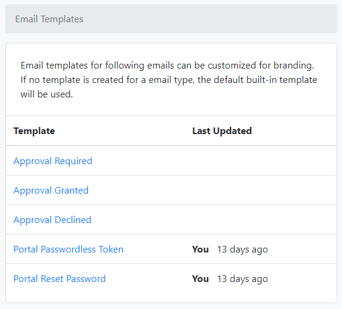
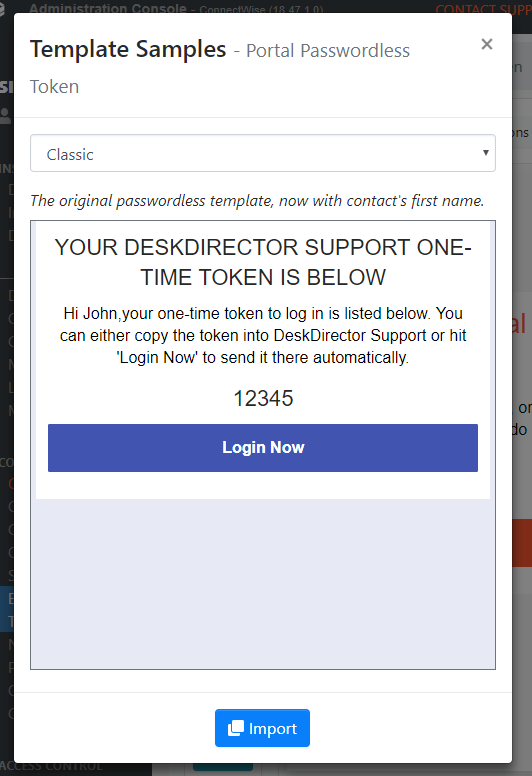
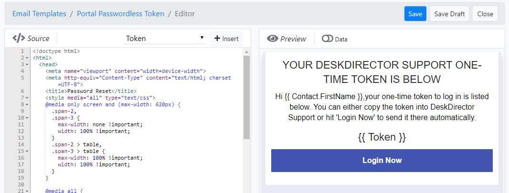
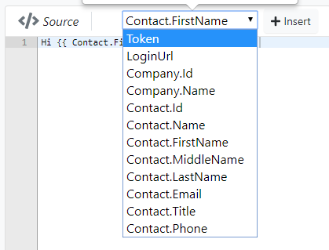
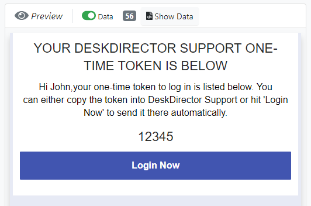

# Email Templates

A email template is made up with HTML content with variables that will be replaced with real data during rendering. E.g:

template:
> Hi {{ Contact.FirstName }}, use {{ Token }} to sign into our portal.

becomes:
> Hi John, use 12345 to sign into our portal. 

Email templates enable customization and branding for the following emails sent from DeskDirector.

* Approval Email (`approval required`, `approval granted` and `approval declined`)
* Passwordless Login
* Reset Password

## Create a template
You templates can be edited in the admin console. To get started, log into admin console and click on the `Email Template` under `CONFIGURATIONS` group in the left-hand side navigation menu.

All of the customizable templates are listed.

The easiest way to create a template is to import a sample template then customize it to fit your need.

To do that, select a template that you want to customize in the list, then click on `View Sample Templates...`, then select a preferred sample from the dropdown list and click on `Import`.

The imported template is saved as a draft template in the `template editor` for you to edit before saving. This means you won't lose your current template until you're happy with how the new template looks and set it to live.

When you're finished editing click on `Save` to set the template to live, or `Save Draft` to continue edit later.

## Use Variables
A variable looks this in the template
> {{ Contact.FirstName }}

Where `Contact` is an object and `FirstName` is a property of the object.

To add a variable, place cursor in the HTML code editor where you want the variable to be at, then select a supported variable from the list on the top of the editor then click on `insert`.

## Preview a Template
Preview feature can be used to verify the template before setting it live.

To preview a template, click on the `data` switch on the top of the preview panel, you can then select a ticket or a contact based on the type of template.

Note: in preview mode, the variables `Token`, `ResetUrl`, `ApprovedBy` and `DeclinedBy` do not use the actually data.

## Reference
[Template Code Reference](./template_code_ref.md)

