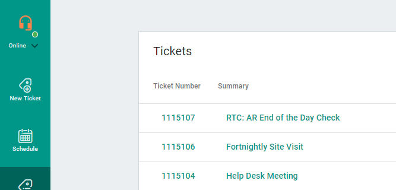
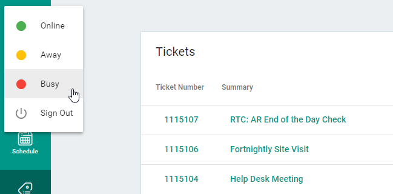

# Changing your presence

It is possible in TECH to change your [presence](../../glossary/p/presence.md) from `Online` to `Away` or `Busy`.

You can do this by clicking your avatar on the top-left of the app:

You can also sign out from this drop down.