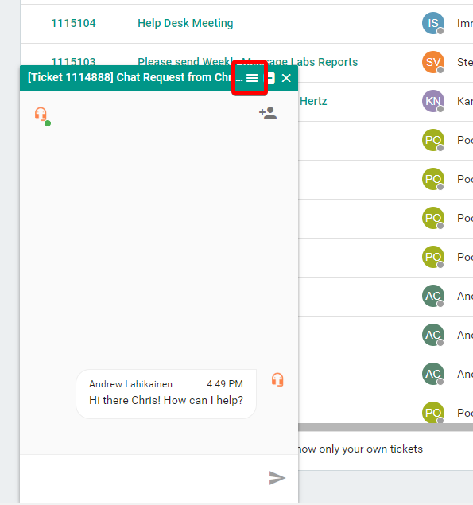
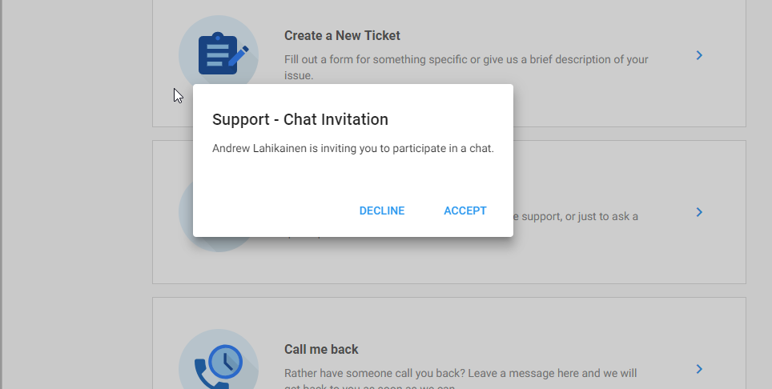
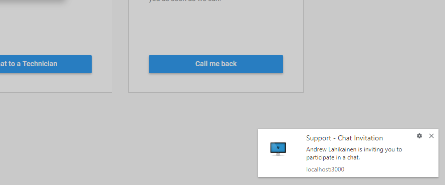
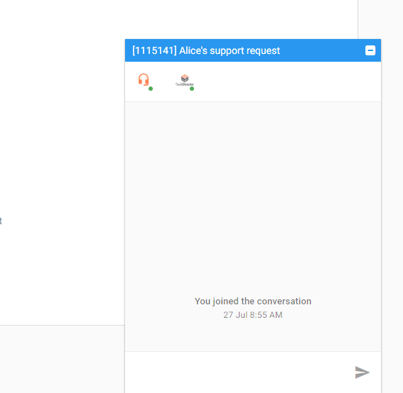
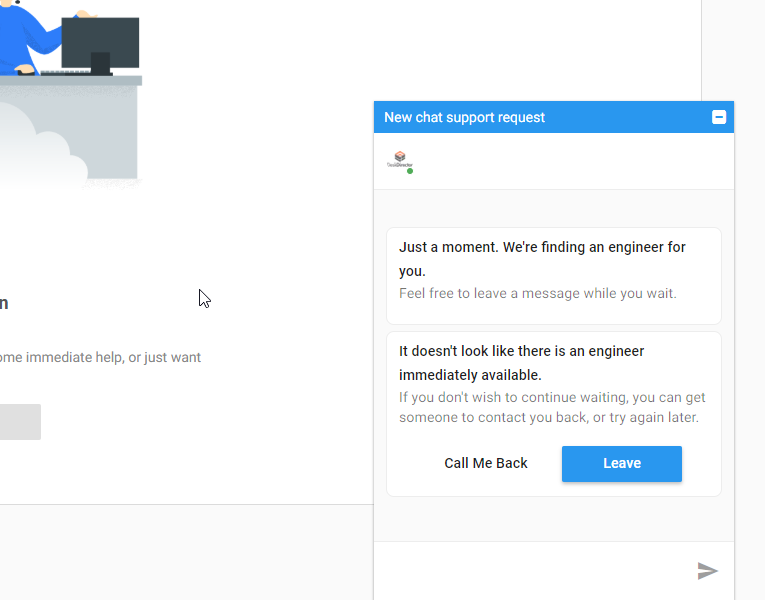
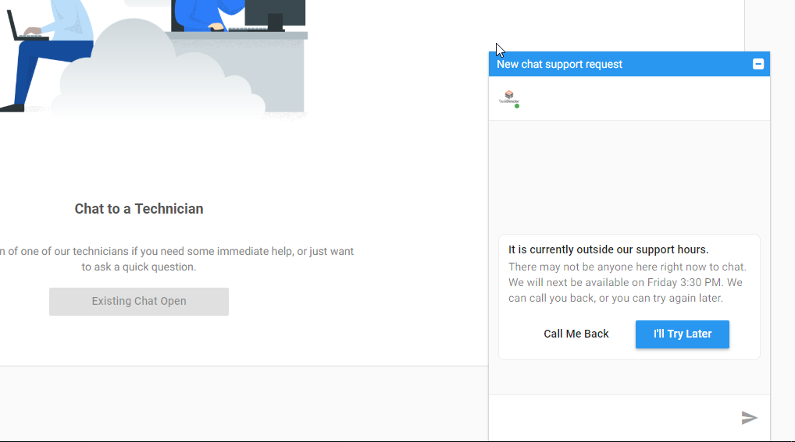
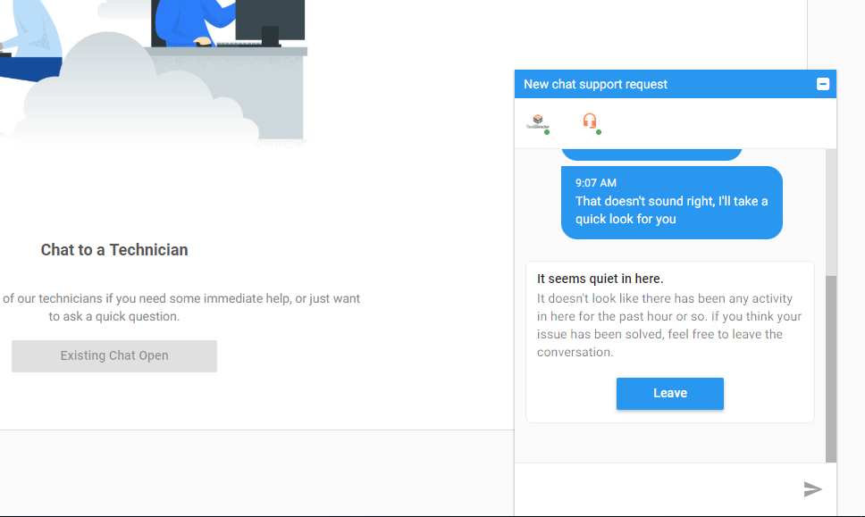
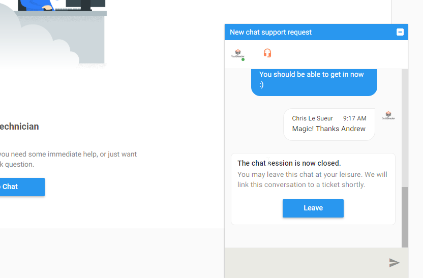

# Handling chat requests

## Tech

### Receiving chat requests

Chat request notifications appear on the top-left side of TECH:

You will only receive these notifications if you are available. See [this](../../glossary/p/presence.md) article for more information about presence.

Chat requests will also show up in the [chat session manager](../../glossary/c/chat_session_manager.md).

If you don't have your TECH tab or browser window visible, a sound will be played and a browser notification will pop up to get your attention.

### Joining chat requests

When you click `Join` on the chat request notification a chat window will pop up at the bottom of the screen. From here you will be able to chat with your customer:

### Ending chat sessions

Once you have solved the customers request, you can end the chat session. To do this, click the menu button on the chat window:

Depending on what type of chat request it is you will have different options to close the session.

#### Pre-ticket chat

For pre-ticket chat requests you will have the option to create a ticket and attach the chat log as an attachment. The other option is to just close the session without creating a ticket, but this is not recommended as all support requests should be captured as a ticket.

#### Post-ticket chat

For post-ticket chat requests you will have the option to end the chat session and automatically attach the chat log as a file.

#### Leaving the chat session

After the chat session has been completed, you will now have the option to leave the chat session. Just click the leave button on the chat window toolbar, or click the leave button on the system message that is displayed inside the chat window.

### Following up on abandoned chat requests

Abandoned chat requests should be followed up on as soon as possible. If the chat request was a [post-ticket chat](../../glossary/c/chat_session.md#post-ticket-chat) you can easily get back in touch with the customer by sending a [push chat](./creating_a_chat_session.md#tech) request to them from the ticket (providing they are online). If the chat request was a [pre-ticket chat](../../glossary/c/chat_session.md#pre-ticket-chat) you will need to get in touch with them in a different way: either by calling them or emailing them.

After you have got in touch with the client and solved their request (or created a ticket for them) you can close the chat session. Just hit the `End Session` button on the chat session card in the chat session manager:

and fill out the dialog:

### Following up on callbacks

The process for following up on callbacks is very similar to abandoned chat requests, but you will be given more information from the client. They will provide you with a phone number to ring and optionally, a message. You can click on these phone numbers directly from the chat session card to call using your phone system software.

## Portal

### Receiving chat requests

Chat request notifications will appear in the centre of the application, forcing users to interact with the dialog.

Chat requests will also create a Web Notification or a OS Desktop Notification if the installed client is running.

### Joining chat requests

When you click `Join` on the chat request dialog a chat window will pop up at the bottom of the screen. From there your customer will be able to chat with your engineer.

### Ending and leaving chat sessions

There are only a few situations where the Portal user will be able to end their own chat session.

- When they have created a new chat request, but no one has answered within a certain timeframe.

- When they have created a new chat request, but it is currently outside of your support hours, as configured inside of your `Office Hours`.

- When they have been communicating with an engineer, but there has not been any chat activity for more than 1 hour.

In all other situations, the burden is on the engineer to formally complete the conversation. Once an engineer has ended a chat session, the user will be presented with the ability to leave.

