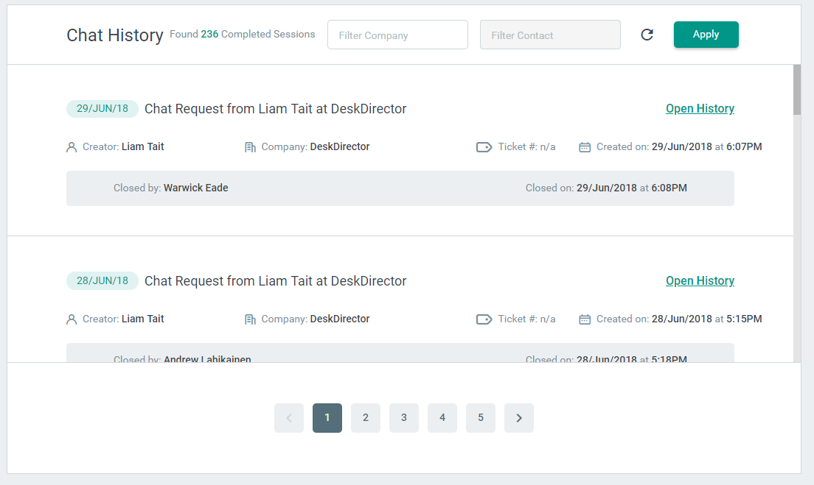
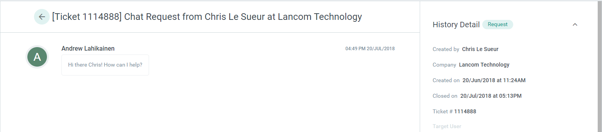

# Viewing chat history

Sometimes you need to go back and reference a chat session. The most common reason for doing this is to follow up on an [abandoned](../../glossary/c/chat_session.md) chat request to see if they left any messages.

## From the [chat session manager](../../glossary/c/chat_session_manager.md)

To view chat history from the chat session manager, just click the view session button on the abandoned chat session card:

## From the chat history list

The chat history list allows you to search through all previous chat sessions. One reason you might come to this page is to search for an abandoned chat session that you closed to add a note to it.

To make it easier to search for the right chat session, you can filter by company and contact:

To view the chat history just click the Open History link.

## Chat history

From the chat history details page you can view the chat log as well as all the other details of the chat session. If you were the person who closed the chat session you will be able to add or edit the closing note.

