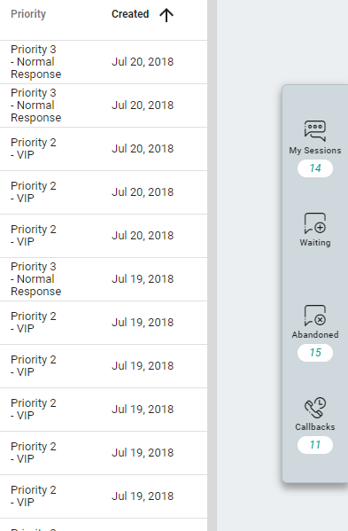
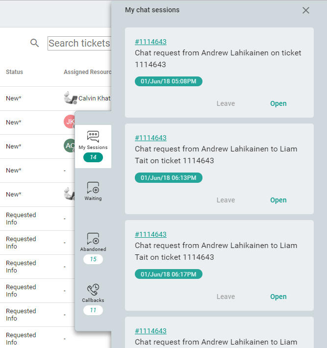

# Chat session manager

The chat session manager organises your chat requests so you can keep an eye on incoming chat requests as well as manage your chat windows.

## Opening the chat session manager

The chat session manager is located on the right side of TECH:

## Chat session manager tabs

Most chat session manager tabs correspond to [chat session statuses](./chat_session.md).

### My sessions

These are the ongoing chat sessions you have joined.

### Waiting

These are all the chat sessions that are the waiting status. These need to be picked up as quickly as possible to ensure clients have a good chat experience.

### Abandoned

These are all the chat sessions that have been abandoned. This happens when a client has been waiting for too long for a member/resource to join their chat session.

### Callbacks

These are all the chat sessions that have a request for a callback. This can happen in a few different ways discussed [here](./chat_session.md).